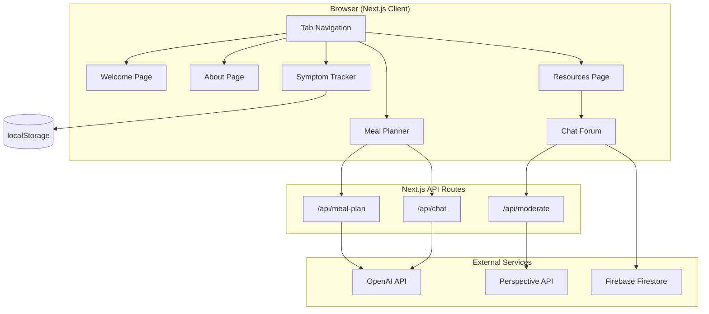
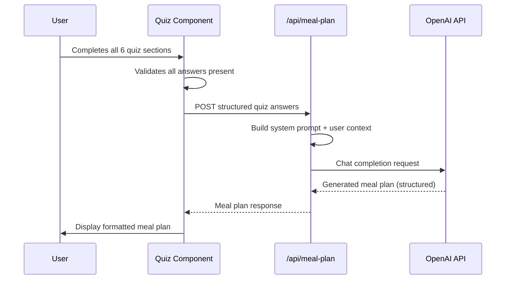
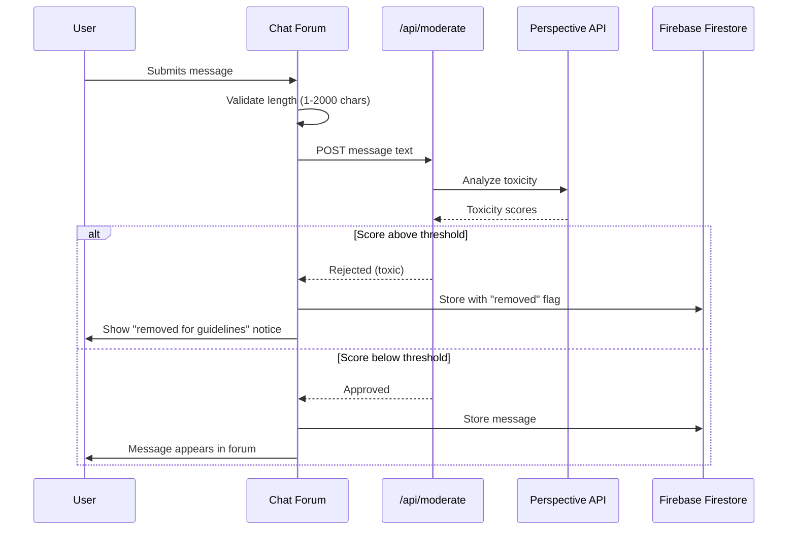

# Design Document: Crohn's Buddy Website

## Overview

Crohn's Buddy is a single-page web application built with **Next.js 14** (App Router), **React 18**, and **Tailwind CSS**. It provides a blue-themed, accessible interface with five tabbed sections for Crohn's Disease patients — primarily teens and young adults. The application integrates with the **OpenAI API** for AI-powered meal plan generation and chat, uses **Firebase Firestore** for the community chat forum with real-time updates, and **localStorage** for client-side symptom tracking data persistence.

### Key Design Decisions

| Decision | Choice | Rationale |
|----------|--------|-----------|
| Framework | Next.js 14 (App Router) | Server-side API routes protect API keys; React ecosystem for component composition |
| Styling | Tailwind CSS | Rapid theming with custom blue palette; utility-first for consistent design |
| AI Provider | OpenAI GPT-4o-mini | Cost-effective for meal plan generation; strong instruction-following for structured output |
| Chat Backend | Firebase Firestore | Real-time listeners for live chat; minimal backend setup for a student project |
| Symptom Storage | localStorage | No authentication required; privacy-preserving; simple for the target audience |
| Content Moderation | Perspective API (via server-side) | Google's toxicity detection; pre-publish filtering for hate speech |

## Architecture



### Request Flow: Meal Plan Generation



### Request Flow: Chat Message Posting



## Components and Interfaces

### Page Components

| Component | File Path | Responsibility |
|-----------|-----------|----------------|
| `TabNavigation` | `src/components/TabNavigation.tsx` | Renders 5 tabs, manages active state, keyboard navigation |
| `WelcomePage` | `src/components/pages/WelcomePage.tsx` | Mission statement, team member cards |
| `AboutPage` | `src/components/pages/AboutPage.tsx` | Educational content sections |
| `SymptomTrackerPage` | `src/components/pages/SymptomTrackerPage.tsx` | Calendar view, questionnaire form |
| `MealPlannerPage` | `src/components/pages/MealPlannerPage.tsx` | Quiz flow, meal plan display, AI chat |
| `ResourcesPage` | `src/components/pages/ResourcesPage.tsx` | External links, chat forum container |

### Symptom Tracker Components

| Component | File Path | Responsibility |
|-----------|-----------|----------------|
| `Calendar` | `src/components/tracker/Calendar.tsx` | Month grid, day selection, entry indicators |
| `TrackerForm` | `src/components/tracker/TrackerForm.tsx` | Daily questionnaire (food, pain, bowel movements, stress) |

### Meal Planner Components

| Component | File Path | Responsibility |
|-----------|-----------|----------------|
| `QuizFlow` | `src/components/planner/QuizFlow.tsx` | Section navigation, progress indicator, validation |
| `QuizSection` | `src/components/planner/QuizSection.tsx` | Renders questions for a single section |
| `MealPlanDisplay` | `src/components/planner/MealPlanDisplay.tsx` | Formatted meal plan output |
| `AIChatInterface` | `src/components/planner/AIChatInterface.tsx` | Conversation UI for refining meal plans |

### Chat Forum Components

| Component | File Path | Responsibility |
|-----------|-----------|----------------|
| `ChatForum` | `src/components/forum/ChatForum.tsx` | Message list, input form, display name prompt |
| `ChatMessage` | `src/components/forum/ChatMessage.tsx` | Single message with author, timestamp, moderation notice |

### API Route Interfaces

```typescript
// POST /api/meal-plan
interface MealPlanRequest {
  quizAnswers: {
    section1_crohnsStatus: Section1Answers;
    section2_medicalSafety: Section2Answers;
    section3_foodTolerance: Section3Answers;
    section4_foodPreferences: Section4Answers;
    section5_lifestyle: Section5Answers;
    section6_output: Section6Answers;
  };
}

interface MealPlanResponse {
  success: boolean;
  mealPlan?: {
    meals: Array<{
      mealName: string;       // e.g., "Breakfast", "Lunch", "Dinner", "Snack"
      items: Array<{
        name: string;
        portion: string;
        notes?: string;
      }>;
    }>;
    summary: string;
    warnings?: string[];
  };
  error?: string;
}

// POST /api/chat
interface ChatRequest {
  message: string;
  conversationHistory: Array<{ role: 'user' | 'assistant'; content: string }>;
  currentMealPlan: string;
}

interface ChatResponse {
  success: boolean;
  reply?: string;
  error?: string;
}

// POST /api/moderate
interface ModerateRequest {
  text: string;
}

interface ModerateResponse {
  approved: boolean;
  reason?: string;
}
```

### Shared Utilities

| Module | File Path | Responsibility |
|--------|-----------|----------------|
| `trackerStorage` | `src/lib/trackerStorage.ts` | Read/write symptom entries to localStorage |
| `quizConfig` | `src/lib/quizConfig.ts` | Question definitions for all 6 quiz sections |
| `firebaseClient` | `src/lib/firebase.ts` | Firebase initialization and Firestore helpers |
| `theme` | `src/lib/theme.ts` | Blue color palette constants |

## Data Models

### Symptom Tracker Entry (localStorage)

```typescript
interface TrackerEntry {
  date: string;              // ISO date string "YYYY-MM-DD"
  foodConsumed: string;      // Free text, max 500 chars
  painLevel: number;         // 1-10 scale
  bowelMovements: number;    // 0-20
  stressLevel: number;       // 1-10 scale (additional question)
  energyLevel: number;       // 1-10 scale (additional question)
  submittedAt: string;       // ISO datetime of submission
}

// localStorage key: "crohns-buddy-tracker-entries"
// Storage format: Record<string, TrackerEntry> keyed by date string
```

### Quiz Answers

```typescript
interface Section1Answers {
  flareStatus: 'active-flare' | 'remission' | 'unsure';
  currentSymptoms: string;                    // Free text description
  symptomChecklist: string[];                 // Array of selected symptoms
  doctorDietInstructions: string;             // Free text or "none"
}

interface Section2Answers {
  surgeryOrObstruction: 'yes' | 'no' | 'unsure';
  recentWeightLoss: 'yes' | 'no';
  foodAllergies: string[];                    // List of allergies
  foodsToAvoid: string[];                     // Specific foods to avoid
}

interface Section3Answers {
  safeFoods: string[];                        // Known safe foods
  triggerFoods: string[];                     // Known trigger foods
  reintroduceFoods: string[];                 // Foods to test
  fiberTolerance: 'low' | 'moderate' | 'high';
}

interface Section4Answers {
  preferredMealTypes: string[];               // e.g., ["soup", "smoothie", "solid"]
  refusedFoods: string[];                     // Won't eat
  proteinPreferences: string[];               // e.g., ["chicken", "fish", "tofu"]
  carbPreferences: string[];                  // e.g., ["rice", "pasta", "bread"]
}

interface Section5Answers {
  mealPlanDuration: 'daily' | 'weekly' | '3-day';
  cookingTime: 'minimal' | 'moderate' | 'extended';
  applianceAccess: string[];                  // e.g., ["stove", "microwave", "blender"]
  mealsPerDay: number;                        // 2-6
}

interface Section6Answers {
  dietaryGoals: string[];                     // e.g., ["weight-gain", "reduce-inflammation"]
  outputFormat: 'simple-list' | 'detailed-recipes' | 'grocery-list';
  adventurousness: 'conservative' | 'moderate' | 'adventurous';
  extraNotes: string;                         // Free text
}
```

### Chat Forum Message (Firestore)

```typescript
interface ForumMessage {
  id: string;                // Firestore document ID
  displayName: string;       // 1-50 characters
  content: string;           // 1-2000 characters (original text)
  removed: boolean;          // true if moderation removed it
  removalNotice?: string;    // "This message was removed for violating community guidelines"
  timestamp: Timestamp;      // Firestore server timestamp
}

// Firestore collection: "forum-messages"
// Ordering: timestamp descending
```

### AI Chat Session (Client State)

```typescript
interface ChatSession {
  conversationHistory: Array<{
    role: 'user' | 'assistant';
    content: string;
  }>;
  currentMealPlan: string;
  isLoading: boolean;
}
```


## Correctness Properties

*A property is a characteristic or behavior that should hold true across all valid executions of a system — essentially, a formal statement about what the system should do. Properties serve as the bridge between human-readable specifications and machine-verifiable correctness guarantees.*

### Property 1: Tab Navigation Displays Correct Page

*For any* tab identifier in the set {"Welcome", "About Crohn's", "Symptom Tracker", "AI Meal Planner", "Resources"}, activating that tab shall result in the corresponding page component being rendered and all other page components being hidden.

**Validates: Requirements 1.4**

### Property 2: Date-Based Form Visibility

*For any* date, the symptom tracker questionnaire form is presented if and only if the date is today or in the past. Future dates shall never present the form.

**Validates: Requirements 4.2, 4.10**

### Property 3: Tracker Entry Field Validation

*For any* tracker entry submission, the entry is accepted if and only if: the food consumed field is ≤500 characters, the pain level is an integer between 1 and 10 inclusive, and the bowel movements count is an integer between 0 and 20 inclusive. Any value outside these ranges shall be rejected.

**Validates: Requirements 4.3, 4.4, 4.5**

### Property 4: Tracker Entry Persistence Round Trip

*For any* valid tracker entry and associated date, saving the entry to localStorage and then reading it back shall produce an entry with identical field values associated with the same date.

**Validates: Requirements 4.7, 4.8**

### Property 5: Quiz Prompt Compilation Completeness

*For any* complete set of quiz answers across all six sections, the compiled prompt string shall contain every individual answer organized by its section name and question, with no answers omitted or duplicated.

**Validates: Requirements 5.10**

### Property 6: Quiz Section Validation Prevents Incomplete Advancement

*For any* quiz section with at least one unanswered question, attempting to advance to the next section shall be blocked, and the unanswered questions shall be identified to the user.

**Validates: Requirements 5.11**

### Property 7: Meal Plan Display Completeness

*For any* valid meal plan structure containing N meals, the rendered display shall contain exactly N labeled meal sections, each showing its meal name and all associated food items with portion descriptions.

**Validates: Requirements 6.2**

### Property 8: Chat History Preservation

*For any* sequence of messages exchanged in an AI chat session, the conversation history shall contain all messages in their original chronological order, with no messages lost or reordered.

**Validates: Requirements 6.5**

### Property 9: Forum Message Length Validation

*For any* string, it is accepted as a valid forum message if and only if its length is between 1 and 2000 characters inclusive. Empty strings and strings exceeding 2000 characters shall be rejected.

**Validates: Requirements 8.2, 8.7**

### Property 10: Forum Message Chronological Ordering

*For any* set of forum messages with timestamps, the displayed order shall be reverse chronological (most recent first), and each message shall show the author's display name and a timestamp.

**Validates: Requirements 8.3**

### Property 11: Removed Message Notice Replacement

*For any* forum message that has been flagged and removed by the moderation system, the displayed content shall be the community guidelines violation notice, and the original message content shall not be visible to users.

**Validates: Requirements 8.5**

### Property 12: Display Name Length Validation

*For any* string, it is accepted as a valid display name if and only if its length is between 1 and 50 characters inclusive. Empty strings and strings exceeding 50 characters shall be rejected.

**Validates: Requirements 8.8**

## Error Handling

### AI Service Failures

| Scenario | Handling | User Experience |
|----------|----------|----------------|
| OpenAI API timeout (>60s) | Abort request, catch timeout error | Loading spinner stops; error message: "The AI service is taking too long. Please try again." with retry button |
| OpenAI API rate limit (429) | Return error response from API route | Error message: "The service is busy. Please wait a moment and try again." |
| OpenAI API server error (5xx) | Return generic error | Error message: "The AI service is temporarily unavailable. Please try again later." with retry button |
| Invalid/malformed AI response | Catch JSON parse error, return error | Error message: "We received an unexpected response. Please try again." |

### Firebase/Chat Failures

| Scenario | Handling | User Experience |
|----------|----------|----------------|
| Firestore connection failure | Catch connection error | Chat section shows: "Unable to connect to the community chat. Please check your connection." |
| Message write failure | Catch write error, do not clear input | Error message below input: "Failed to send message. Please try again." Input preserved. |
| Perspective API failure | Default to allowing the message (fail-open with logging) | Message posts normally; logged for manual review |

### Client-Side Failures

| Scenario | Handling | User Experience |
|----------|----------|----------------|
| localStorage full | Catch QuotaExceededError | Error message: "Storage is full. Please clear old entries to continue tracking." |
| localStorage unavailable | Detect on mount, set error state | Tracker shows: "Symptom tracking requires browser storage. Please enable it in settings." |
| Invalid form input | Client-side validation before submit | Inline error messages on specific fields; submit button disabled until valid |
| Quiz section incomplete | Prevent navigation, highlight missing | Inline indicators on unanswered questions; "Next" button disabled |

### Network Resilience

- All API calls use a 60-second timeout
- Retry buttons are provided for all recoverable errors
- Form state is preserved across failed submissions (user doesn't lose input)
- Chat forum gracefully degrades to read-only if write operations fail

## Testing Strategy

### Unit Tests (Vitest + React Testing Library)

Unit tests cover specific examples, edge cases, and component behavior:

- **Tab Navigation**: Verify correct tab order, keyboard interaction (Enter/Space), active state on load
- **Welcome Page**: Verify team members render with correct names and roles
- **About Page**: Verify all required sections are present with headings
- **Symptom Tracker Calendar**: Verify current month rendering, day highlighting for entries
- **Quiz Sections**: Verify all 24 questions render in correct sections
- **Resources Page**: Verify external links have `target="_blank"` and `rel="noopener noreferrer"`
- **Chat Forum Layout**: Verify forum appears at bottom of Resources page
- **Error States**: Verify error messages display for all failure scenarios

### Property-Based Tests (fast-check)

Property-based tests verify universal correctness properties across generated inputs. Each property test runs a minimum of 100 iterations.

- **Property 1**: Generate random tab identifiers → verify correct page visibility
  - Tag: `Feature: crohns-buddy-website, Property 1: Tab navigation displays correct page`
- **Property 2**: Generate random dates (past, today, future) → verify form visibility matches date constraint
  - Tag: `Feature: crohns-buddy-website, Property 2: Date-based form visibility`
- **Property 3**: Generate random field values (in-range and out-of-range) → verify validation accepts/rejects correctly
  - Tag: `Feature: crohns-buddy-website, Property 3: Tracker entry field validation`
- **Property 4**: Generate random valid tracker entries → save to localStorage mock → read back → verify equality
  - Tag: `Feature: crohns-buddy-website, Property 4: Tracker entry persistence round trip`
- **Property 5**: Generate random quiz answer sets → compile prompt → verify all answers present
  - Tag: `Feature: crohns-buddy-website, Property 5: Quiz prompt compilation completeness`
- **Property 6**: Generate quiz sections with random missing answers → verify advancement blocked
  - Tag: `Feature: crohns-buddy-website, Property 6: Quiz section validation prevents incomplete advancement`
- **Property 7**: Generate random meal plan structures → render → verify all meals and items shown
  - Tag: `Feature: crohns-buddy-website, Property 7: Meal plan display completeness`
- **Property 8**: Generate random message sequences → append to history → verify order preserved
  - Tag: `Feature: crohns-buddy-website, Property 8: Chat history preservation`
- **Property 9**: Generate random strings of various lengths → verify message validation accepts 1-2000, rejects otherwise
  - Tag: `Feature: crohns-buddy-website, Property 9: Forum message length validation`
- **Property 10**: Generate random message sets with timestamps → verify reverse chronological ordering
  - Tag: `Feature: crohns-buddy-website, Property 10: Forum message chronological ordering`
- **Property 11**: Generate random messages with `removed: true` → verify displayed text is the notice, not original content
  - Tag: `Feature: crohns-buddy-website, Property 11: Removed message notice replacement`
- **Property 12**: Generate random strings of various lengths → verify display name validation accepts 1-50, rejects otherwise
  - Tag: `Feature: crohns-buddy-website, Property 12: Display name length validation`

### Integration Tests

- **AI Meal Plan Flow**: Mock OpenAI API, verify full quiz → generation → display flow
- **AI Chat Flow**: Mock OpenAI API, verify message send → response display → history maintenance
- **Content Moderation**: Mock Perspective API, verify toxicity threshold triggers removal
- **Firebase Chat**: Mock Firestore, verify real-time message loading and posting

### Test Configuration

```json
{
  "framework": "vitest",
  "pbt-library": "fast-check",
  "component-testing": "@testing-library/react",
  "minimum-iterations": 100,
  "coverage-target": "80%"
}
```
