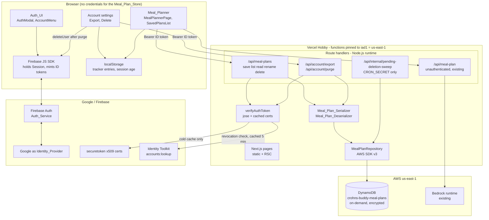
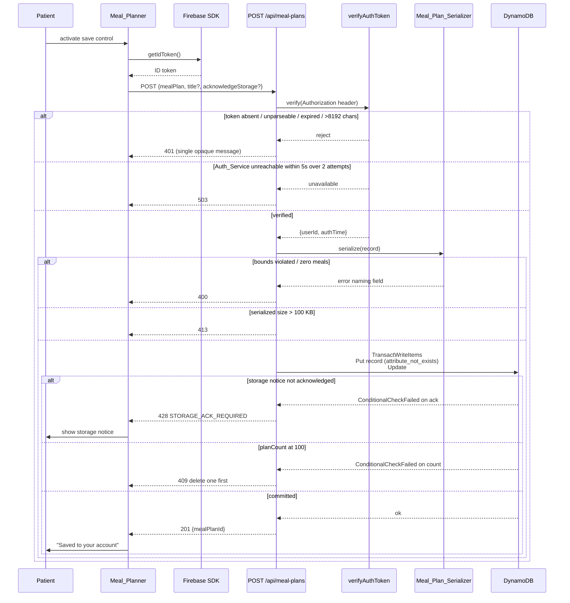
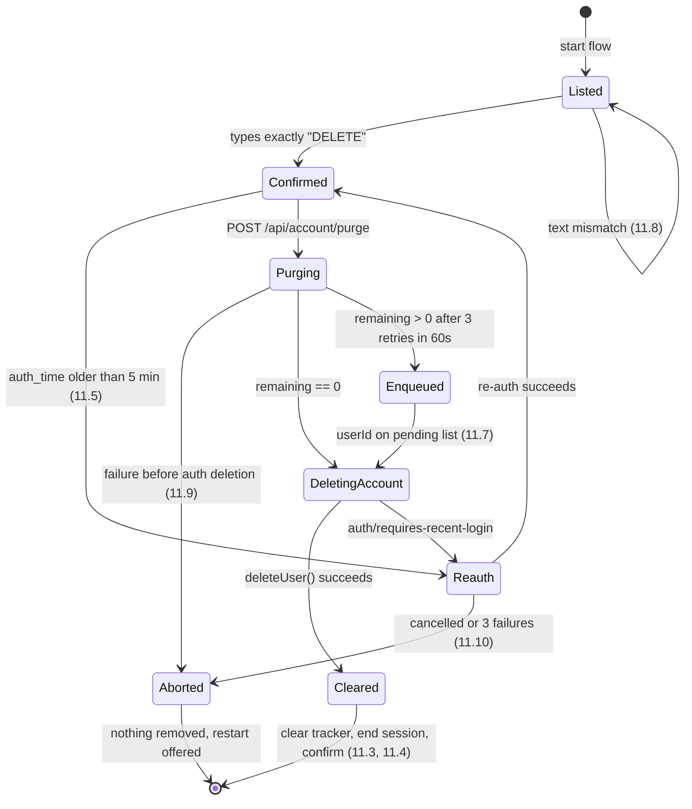

# Design Document

## Overview

This feature turns Crohn's Buddy from a session-scoped tool into an account-backed one. It adds three things: a completed Firebase Authentication surface (email/password plus Google), a per-user Meal_Plan_Store on DynamoDB reached through authenticated Next.js route handlers, and a documented low-cost deployment target.

The design starts from what already exists rather than replacing it:

| Existing asset | Current state | What this feature does to it |
| --- | --- | --- |
| `src/lib/auth.ts` | Email/password signup, signin, signout, `onAuthChange`. Duplicates Firebase app init. | Keep the API, add verification/reset/re-auth helpers, session-age tracking, and attempt throttling. Stop duplicating app init. |
| `src/lib/firebase.ts` | Firestore forum helpers plus a `signInWithGoogle()` popup helper that nothing calls. | Wire `signInWithGoogle()` into the Auth_UI; move it into `auth.ts` so there is one auth module. |
| `src/components/AuthModal.tsx` | Email/password form with per-code error mapping. | Add the Google control, the Privacy_Notice link, retained-field behavior, and the throttle countdown. |
| `src/lib/bedrock.ts` | Calls `bedrock-runtime.{AWS_REGION}.amazonaws.com`, default `us-east-1`, bearer-token auth via `AWS_BEARER_TOKEN_BEDROCK`. | Untouched. Its region is the constraint that pins the Meal_Plan_Store region (Requirement 13.6). |
| `src/app/api/meal-plan/route.ts` | Unauthenticated Meal_Plan generation. | Untouched. Generation stays available with no Session (Requirements 5.12, 6.10). New storage routes live under `/api/meal-plans`. |
| `src/lib/trackerStorage.ts` | localStorage tracker entries. | Untouched as the source of truth. Read for export (10.2) and cleared on account deletion (11.3). |

Three decisions carry most of the design's weight, so they are stated up front with their reasoning.

**Decision 1 — Google sign-in uses popup, with redirect only as a fallback.** Requirement 3.6 requires returning to the account modal within 2 seconds and showing no error when the Patient cancels the provider window, and Requirement 3.9 requires a 120-second timeout the Auth_UI enforces itself. A redirect flow unloads the page, so the modal, the retained form values (1.3, 1.4, 1.9, 1.10), the cancellation signal, and the timeout clock are all destroyed; on return, a cancelled attempt is indistinguishable from a cold page load. `signInWithPopup` keeps the modal mounted and rejects with `auth/popup-closed-by-user`, which maps directly onto 3.6. The cost is that popups are blocked in some embedded browsers, so a rejection of `auth/popup-blocked` or `auth/operation-not-supported-in-this-environment` falls back to `signInWithRedirect`, reconciled by `getRedirectResult()` on mount. In the fallback path 3.6 degrades to "no error shown", which is the observable requirement, though the 2-second bound becomes page-load-bound.

**Decision 2 — ID tokens are verified locally against Google's public certificates, not with the Firebase Admin SDK.** Requirement 13.2 makes cold starts the normal case rather than the exception, and 13.13 caps the first response after an idle interval at 10 seconds. `firebase-admin` is a large dependency tree that must be pulled into every serverless function bundle, and it needs a service-account private key — a multi-line, high-value secret — in platform environment configuration (13.7). Local verification with `jose` needs only the Firebase project ID (already a `NEXT_PUBLIC_` value) and Google's published certificates, adds no per-request outbound call on the happy path, and keeps Active CPU inside the Hobby allowance. The one thing local verification cannot see is revocation, which Requirement 4.6 demands; that is covered by a narrow Identity Toolkit REST lookup described in [Auth token verification](#4-auth-token-verification-req-4). Full trade-off analysis is in that section.

**Decision 3 — the Meal_Plan_Id is a ULID, which makes the sort key do the ordering work.** Requirement 7.1 fixes the partition key as User_Id and the sort key as Meal_Plan_Id, and Requirement 6.2 asks for reverse-chronological listing with a stable tie-break for identical creation timestamps. A DynamoDB `Query` can only order by sort key, so ordering by creation time would normally need a GSI with a timestamp key — extra writes, extra cost, and eventual consistency. A [ULID](https://github.com/ulid/spec) is 26 Crockford base-32 characters whose leading 48 bits are the creation time in milliseconds and whose trailing 80 bits are random. It is lexicographically sortable, it contains only uppercase letters and digits (so it satisfies Requirement 7.8's charset), and its random suffix gives a deterministic total order for records created in the same millisecond. `Query` with `ScanIndexForward: false` therefore *is* newest-first-with-stable-tie-break, with no GSI and no extra cost. Requirement 6.2 is satisfied by the key design rather than by sorting code.

A fourth structural consequence is worth naming because it removes a whole class of bug: because User_Id is the partition key and is *always* derived from the verified token, a reference to another account's Meal_Plan_Id and a reference to a Meal_Plan_Id that exists nowhere produce the identical DynamoDB outcome — a key that is not present in the caller's partition. Requirements 7.3 and 7.4 (identical status, message, and fields for both cases) hold by construction, not by a comparison the code could forget.

## Architecture

### System context



### Save request sequence

The save path is the one that touches every cross-cutting concern — verification, acknowledgment, size, cap, idempotency — so it is worth tracing end to end.



### Layering and dependency rules

Four layers, each depending only downward. The boundaries exist to make the correctness properties testable in isolation, without a DynamoDB endpoint or a live Firebase project.

1. **Pure domain** — `mealPlanSerializer.ts`, `mealPlanTitle.ts`, `mealPlanId.ts`, `pagination.ts`. No I/O, no clock, no randomness except through injected parameters. This is where property-based tests do their work.
2. **Ports** — `MealPlanRepository` and `AuthTokenVerifier` interfaces. Route handlers depend on the interfaces, never on the AWS SDK or `jose` directly, so an in-memory repository can substitute in tests.
3. **Adapters** — `dynamoMealPlanRepository.ts`, `joseAuthTokenVerifier.ts`. The only modules that import the AWS SDK or touch the network.
4. **Route handlers** — thin. Verify, validate, delegate, map errors to statuses.

The clock and the ID generator are injected (`() => Date`, `() => string`) rather than called directly, because Requirements 5.2, 8.4, and 9.1 all constrain timestamp behavior and property tests need those deterministic.

## Components and Interfaces

### 1. Firebase client consolidation

`src/lib/auth.ts` and `src/lib/firebase.ts` today each call `initializeApp`, guarded by `getApps().length`. It works, but the config object is duplicated and the Google helper sits in the Firestore module where the Auth_UI never looks for it. Consolidate:

- **`src/lib/firebaseClient.ts`** (new) — sole owner of `firebaseConfig`, `getFirebaseApp()`, and `isFirebaseConfigured()`.
- **`src/lib/auth.ts`** — all Auth_Service interaction. Absorbs `signInWithGoogle`, `signOut`, `onAuthChange`. Existing exports keep their signatures so `AuthModal.tsx` and any current callers are unaffected.
- **`src/lib/firebase.ts`** — Firestore forum helpers only. Its auth re-exports become thin re-exports from `auth.ts` for one release, then go away.

```ts
// src/lib/auth.ts — additions
export interface AuthSession {
  userId: string;          // Firebase uid, the User_Id
  displayName: string;
  email: string;
  emailVerified: boolean;
  authTimeMs: number;      // most recent successful authentication
  sessionStartedAtMs: number;
}

export async function signUp(email: string, password: string, displayName: string): Promise<User>;
export async function signIn(email: string, password: string): Promise<User>;
export async function signInWithGoogle(): Promise<GoogleSignInOutcome>;
export async function signOutEverywhere(): Promise<void>;
export async function sendVerificationEmail(): Promise<void>;
export async function requestPasswordReset(email: string): Promise<void>; // never reveals existence
export async function reauthenticate(): Promise<void>;
export async function deleteCurrentAccount(): Promise<void>;
export function onAuthChange(cb: (s: AuthSession | null) => void): Unsubscribe;
export async function getIdTokenForRequest(): Promise<string | null>;

export type GoogleSignInOutcome =
  | { status: 'signed-in'; session: AuthSession }
  | { status: 'cancelled' }                        // Req 3.6 — no error message
  | { status: 'timed-out' }                        // Req 3.9 — 120s
  | { status: 'no-email' }                         // Req 3.8
  | { status: 'failed'; code: string };            // Req 3.7
```

Returning a discriminated union instead of throwing matters here: Requirements 3.6, 3.7, 3.8, and 3.9 each prescribe a *different* Auth_UI outcome, and the current `AuthModal` pattern of string-matching `err.message` cannot distinguish them reliably.

Sign-in persistence uses `browserLocalPersistence`. Firebase refresh tokens do not expire on their own, so the 30-day Session bound in Requirement 2.7 is enforced by the application: `sessionStartedAtMs` is written to localStorage on every successful authentication, and `onAuthChange` checks it on every load. Past 30 days, the client signs out, clears the plan list, and shows the expiry message (2.13). This is honest about its limits — clearing localStorage resets the clock — so it is a session-hygiene measure, not a security boundary; the security boundary is the one-hour ID token lifetime enforced server-side.

**Signin attempt throttling (Requirement 2.3).** The requirement prescribes an exact behavior — block for 60 seconds after 10 failures in 5 minutes, and show the remaining seconds. Firebase's own abuse protection is real but opaque: it does not expose a countdown. So a client-side ledger in localStorage, keyed by a SHA-256 hash of the lowercased email (never the address itself), records failure timestamps and gates the request so no call reaches the Auth_Service while blocked. Stated plainly: a per-browser ledger is a UX affordance and is trivially bypassed by clearing storage. The actual server-side protection remains Firebase Authentication's built-in rate limiting, with Firebase App Check as the recommended follow-on. Requirement 2.11 (client-side validation failures) and 2.12 (transport failures) both explicitly must not count against the ledger, so only credential rejections increment it.

### 2. Auth_UI components

| Component | File | Responsibility |
| --- | --- | --- |
| `AuthModal` | `src/components/AuthModal.tsx` (modify) | Signup/signin forms, field-level validation and retention (1.3–1.5, 1.9, 1.10, 2.2, 2.11), Google control (3.1), Privacy_Notice link (1.8, 12.2), throttle countdown (2.3), password reset entry (2.9) |
| `GoogleSignInButton` | `src/components/auth/GoogleSignInButton.tsx` (new) | One control per configured Identity_Provider, pointer- and keyboard-operable (3.1, 3.10) |
| `AccountMenu` | `src/components/auth/AccountMenu.tsx` (new) | Header display name + signout, rendered on every page (2.4, 2.8) |
| `EmailVerificationBanner` | `src/components/auth/EmailVerificationBanner.tsx` (new) | Pending-verification indicator, resend with 60s throttle (1.7) |
| `SessionProvider` | `src/components/auth/SessionProvider.tsx` (new) | React context over `onAuthChange`, 30-day expiry check, clears plan view on signout/expiry (2.5, 2.8, 2.13) |
| `PrivacyNotice` | `src/app/privacy/page.tsx` (new) | Static, readable with no Session (12.1, 12.2, 12.10) |

`SessionProvider` is mounted in `src/app/layout.tsx`, which currently renders only `{children}`. Requirement 2.4 asks for the header on *every* page, and the app is a single-page shell with `TabNavigation`, so the provider and `AccountMenu` belong in the root layout rather than in `page.tsx`.

Identity_Provider controls are driven by `NEXT_PUBLIC_AUTH_PROVIDERS` (comma-separated, e.g. `google`). An empty or absent value renders zero social controls and leaves email/password fully available (3.10).

### 3. Saved plans UI

| Component | File | Responsibility |
| --- | --- | --- |
| `SavedPlansList` | `src/components/planner/SavedPlansList.tsx` | Title + `YYYY-MM-DD` rows, progress indicator, empty state, load-more, retry (6.1, 6.3, 6.5, 6.6, 6.8, 6.10) |
| `SavePlanControl` | `src/components/planner/SavePlanControl.tsx` | Save control, confirmation, retry, signed-out message, holds the returned Meal_Plan_Id (5.1, 5.10–5.13) |
| `StorageNoticeDialog` | `src/components/planner/StorageNoticeDialog.tsx` | First-save storage notice naming the region, acknowledge/decline (12.3, 12.5) |
| `RenamePlanDialog` / `DeletePlanDialog` | `src/components/planner/` | Title validation before any request, delete confirmation naming the title with exactly one confirm and one cancel (8.2, 8.6) |
| `AccountSettingsPage` | `src/components/pages/AccountSettingsPage.tsx` | Export control, deletion flow, Privacy_Notice link (10.1, 11.1, 11.2, 12.2) |

`MealPlannerPage` gains `savedMealPlanId` state. Requirement 5.13 requires that a second activation of the save control updates the same record, so the id returned by the create call is retained alongside the displayed plan and drives `POST` versus `PUT`. Requirement 6.7 requires that reopening a stored plan replaces the AI chat context, so `compiledPrompt` is recomputed from the stored plan and the previously displayed plan stops being passed to `AIChatInterface`.

### 4. Auth token verification (Req 4)

```ts
// src/lib/server/authTokenVerifier.ts
export interface VerifiedIdentity {
  userId: string;      // sub claim — the User_Id
  authTimeMs: number;  // auth_time claim — drives Req 11.5 re-auth window
  email: string;
  displayName: string;
}

export type VerifyResult =
  | { ok: true; identity: VerifiedIdentity }
  | { ok: false; kind: 'missing' }        // 401, Req 4.2
  | { ok: false; kind: 'invalid' }        // 401 single opaque message, Req 4.3/4.6/4.7
  | { ok: false; kind: 'unavailable' };   // 503, Req 4.5

export async function verifyAuthToken(
  req: Request,
  opts?: { requireFreshRevocationCheck?: boolean }
): Promise<VerifyResult>;
```

Order of operations, chosen so the cheapest rejections happen first and nothing reaches the network or the store unnecessarily:

1. Read `Authorization: Bearer <token>`. Absent or malformed prefix → `missing` (4.2).
2. Length guard: `> 8192` characters → `invalid`, with no request to the Auth_Service at all (4.7).
3. Read the JWT header, require `alg: RS256` and a `kid`.
4. Resolve the signing certificate from an in-process cache of `https://www.googleapis.com/robot/v1/metadata/x509/securetoken@system.gserviceaccount.com`, respecting the response's `Cache-Control: max-age` (about 6 hours in practice). On a cold cache this is one outbound call, subject to the 5-second / 2-attempt budget in 4.5.
5. Verify the signature and claims: `iss === https://securetoken.google.com/${projectId}`, `aud === projectId`, `sub` non-empty and ≤ 128 characters, `auth_time` not in the future, and `exp` with `clockTolerance: 60` seconds — which is exactly the "expiry more than 60 seconds in the past" boundary in 4.3.
6. Revocation and account-state check (4.6): `POST https://identitytoolkit.googleapis.com/v1/accounts:lookup?key=${apiKey}` with `{ idToken }`. A `USER_NOT_FOUND` error, `disabled: true`, or `validSince` newer than the token's `auth_time` all map to `invalid`. The result is cached in-process keyed by `(sub, auth_time)` for 5 minutes.

Every rejection in steps 2, 3, 5, and 6 returns the same `invalid` kind and the route maps it to one identical 401 body, so nothing in the response distinguishes a bad signature from an expired token from a revoked session (4.3, 4.6).

**Why not the Admin SDK, in full.** The alternative was `firebase-admin` with `verifyIdToken(token, true)`, which does all of the above in one call.

| Dimension | `jose` + local certs + REST lookup | `firebase-admin` |
| --- | --- | --- |
| Bundled size per function | `jose` is dependency-free, tens of KB | Large transitive tree, on the order of megabytes |
| Cold start | Negligible module init | Measurably slower, and Req 13.2 makes cold starts routine while 13.13 caps the first response at 10s |
| Secrets required (13.7) | Project ID and Web API key, both already public config | Service-account private key: a new high-value multi-line secret |
| Blast radius if the secret leaks | None beyond what the browser already ships | Full project administrative access |
| Network calls on happy path | Zero once certs and lookup are cached | At least the same lookup when `checkRevoked` is true |
| Revocation visibility | Up to 5 minutes stale on read paths | Immediate when `checkRevoked` is true |

The accepted trade-off is the last row. Mutating routes (`POST`, `PUT`, `PATCH`, `DELETE`, export, purge) pass `requireFreshRevocationCheck: true` and bypass the cache; list and read tolerate up to 5 minutes of staleness. Since an ID token is only valid for an hour anyway, the exposure window shrinks rather than grows relative to the token's own lifetime, and it is bounded by a constant we control.

### 5. Meal_Plan_API route surface

All handlers are Node.js runtime (the AWS SDK needs Node crypto for SigV4), dynamic, and region-pinned:

```ts
export const runtime = 'nodejs';
export const dynamic = 'force-dynamic';
export const preferredRegion = 'iad1'; // us-east-1 — Req 13.6
```

| Method & path | File | Purpose | Success | Documented failures |
| --- | --- | --- | --- | --- |
| `POST /api/meal-plans` | `src/app/api/meal-plans/route.ts` | Create (5.2) | `201 {mealPlanId, title, createdAt, updatedAt}` | 400 no meals/bounds (5.15, 9.8), 401 (4.2–4.7), 409 cap (5.9), 413 size (5.7), 428 ack (12.3), 503 (4.5) |
| `GET /api/meal-plans` | same file | List page of 20 (6.1–6.3) | `200 {items, nextCursor?}` | 400 bad cursor, 401, 503 |
| `GET /api/meal-plans/{mealPlanId}` | `src/app/api/meal-plans/[mealPlanId]/route.ts` | Read one (6.4) | `200 {record}` | 401, 404 (7.3, 7.4, 7.8), 422 deserializer error (6.9), 503 |
| `PUT /api/meal-plans/{mealPlanId}` | same file | Update content (5.3, 5.4) | `200 {mealPlanId, updatedAt}` | 400, 401, 404, 413, 503 |
| `PATCH /api/meal-plans/{mealPlanId}` | same file | Rename (8.4) | `200 {title, updatedAt}` | 400 title bounds, 401, 404 (8.7), 503 |
| `DELETE /api/meal-plans/{mealPlanId}` | same file | Delete (8.1) | `204` — also when already absent (8.3) | 401, 404 malformed id (7.8), 503 |
| `GET /api/account/export` | `src/app/api/account/export/route.ts` | Server half of the export (10.2) | `200` JSON with `Content-Disposition` | 401 (10.8), 503 (10.9) |
| `POST /api/account/purge` | `src/app/api/account/purge/route.ts` | Delete every record for the derived User_Id (11.3) | `200 {deletedCount, remaining}` | 401, 500 partial (11.9), 503 |
| `POST /api/internal/pending-deletion-sweep` | `src/app/api/internal/pending-deletion-sweep/route.ts` | Daily retry of the pending-deletion list (11.7) | `200 {processed, cleared, stillPending}` | 401 bad `CRON_SECRET` |

`/api/meal-plans` (plural) deliberately does not collide with the existing `/api/meal-plan` generation route, which stays unauthenticated.

The sweep route is the one endpoint exempt from Requirement 4, and the reason is structural: it runs after the Account has been removed from the Auth_Service, so no Auth_Token for that User_Id can exist. It authenticates with a `Bearer ${CRON_SECRET}` header compared in constant time, accepts no request-controlled User_Id, and touches nothing outside the pending-deletion partition.

Shared middleware, `src/lib/server/withAuth.ts`, wraps every authenticated handler so the verify-then-derive order in Requirement 4.1 cannot be skipped by a new route:

```ts
export function withAuth(
  handler: (req: Request, ctx: { identity: VerifiedIdentity; params: Record<string, string> }) => Promise<Response>,
  opts?: { freshRevocationCheck?: boolean }
): (req: Request, ctx: { params: Record<string, string> }) => Promise<Response>;
```

Requirement 4.4 is enforced here rather than per-route: the wrapper strips any `userId` key from the parsed body and query before the handler sees it, and the handler has no way to obtain a User_Id other than `ctx.identity.userId`. A request that supplies a mismatched `userId` completes normally against the derived one, with no error — which is precisely what 4.4 asks for.

### 6. Meal_Plan_Serializer and Meal_Plan_Deserializer

```ts
// src/lib/mealPlanSerializer.ts
export function serializeMealPlanRecord(record: MealPlanRecord): MealPlanItem;    // throws MealPlanValidationError
export function deserializeMealPlanItem(item: unknown): MealPlanRecord;          // throws MealPlanItemError

export class MealPlanValidationError extends Error {
  constructor(readonly field: string, readonly bound: string) { /* names the field — Req 9.8 */ }
}
export class MealPlanItemError extends Error {
  constructor(readonly attribute: string, readonly reason: 'missing' | 'wrong-type') { /* Req 9.5 */ }
}
export function serializedByteLength(item: MealPlanItem): number;                 // Req 5.7
```

Four choices here are load-bearing:

**Nested maps, never DynamoDB Sets.** Requirements 6.4 and 9.3 require that meal order, item order within a meal, and warning order all survive a round trip. DynamoDB's `SS`/`NS` set types are unordered and silently deduplicate. Every collection is therefore an `L` list. No set type appears anywhere in the schema, and a test asserts this.

**A nested map for content, not a JSON blob string.** A single `content` string would be simpler and marginally smaller. It is rejected because Requirement 9.5 requires the deserializer to name the specific attribute at fault when a value has the wrong type, which needs per-attribute typing to report; a blob collapses every possible defect into "content failed to parse". The nested map also lets the list query project only metadata attributes, which is what keeps read cost near zero.

**Absent means absent.** Requirements 9.4 and 9.9 draw a hard line between an omitted value and an empty one. `notes` and `warnings` are omitted from the item entirely when absent, and the deserializer produces a record where the key is absent rather than `''` or `[]`. Note that `serialize(deserialize(x))` for a record with `warnings: []` is not the identity — it produces an item with no `warnings` attribute, and deserializing that yields a record with no `warnings` key. The round-trip property is therefore stated over records in canonical form, where absent and empty are already collapsed, and a separate property covers the omission behavior directly.

**Timestamps are ISO-8601 UTC strings with exactly three fractional digits** (`new Date(ms).toISOString()`), stored as `S`. Requirement 9.1 requires millisecond precision retained as UTC; a `N` attribute would work numerically but loses the self-describing UTC form, and a string keeps the same lexicographic ordering as the numeric value. The serializer additionally asserts that the millisecond timestamp embedded in the ULID `mealPlanId` equals `createdAt`, which keeps Decision 3's ordering guarantee from silently drifting.

Character fidelity (9.6) needs no escaping layer of our own: the AWS SDK transports strings as UTF-8 and the document client does not transform them. The one genuine hazard is a lone surrogate, which is not valid UTF-8; the serializer rejects lone surrogates as a `wrong-type` validation error naming the field rather than writing a value that would come back altered. No Unicode normalization is applied in either direction, so NFC and NFD inputs each round-trip to themselves.

### 7. MealPlanRepository

```ts
// src/lib/server/mealPlanRepository.ts
export interface ListPage { items: MealPlanSummary[]; nextCursor?: string; }
export type SaveOutcome =
  | { kind: 'created'; mealPlanId: string }
  | { kind: 'updated' }
  | { kind: 'cap-reached' }      // Req 5.9 → 409
  | { kind: 'ack-required' }     // Req 12.3 → 428
  | { kind: 'not-found' };       // Req 7.3, 7.4 → 404

export interface MealPlanRepository {
  create(userId: string, record: MealPlanRecord, ackStorage: boolean): Promise<SaveOutcome>;
  update(userId: string, record: MealPlanRecord): Promise<SaveOutcome>;
  rename(userId: string, mealPlanId: string, title: string, nowMs: number): Promise<SaveOutcome>;
  get(userId: string, mealPlanId: string): Promise<MealPlanRecord | null>;
  list(userId: string, cursor?: string): Promise<ListPage>;
  listAll(userId: string): Promise<MealPlanRecord[]>;   // export — no page limit, Req 10.2
  delete(userId: string, mealPlanId: string): Promise<void>;   // idempotent, Req 8.3
  purge(userId: string): Promise<{ deletedCount: number; remaining: number }>;
  enqueuePendingDeletion(userId: string): Promise<void>;
  listPendingDeletions(nowMs: number): Promise<PendingDeletion[]>;
}
```

Every method takes `userId` as its first parameter and no method accepts a scan or a cross-partition read. There is no repository operation capable of reading more than one User_Id, which is how Requirement 7.2's "no operation that reads across more than one User_Id" is enforced — by the absence of an affordance rather than by a guard.

Two implementations: `dynamoMealPlanRepository.ts` for production and `inMemoryMealPlanRepository.ts` for tests. The in-memory one is not a loose mock; it reimplements the cap, the ordering, the cursor semantics, and the idempotency conditions, which makes it usable as the model in the model-based ordering and pagination properties.

**Logging (Requirement 7.6).** `src/lib/server/storeLog.ts` exports exactly one function whose parameter type makes a violation a compile error:

```ts
export function logStoreOp(entry: {
  mealPlanId: string;
  op: 'create' | 'update' | 'rename' | 'get' | 'list' | 'delete' | 'purge';
  outcome: 'success' | 'failure';
  failureCategory?: 'not-found' | 'cap' | 'size' | 'throttled' | 'unavailable' | 'validation';
  atMs: number;
}): void;
```

There is no `unknown`, no index signature, and no `userId` field, so content, quiz answers, email addresses, display names, and tokens cannot be passed even by accident. Route handlers are forbidden from calling `console.*` directly for store operations; ESLint's `no-console` with an allowlist for this module enforces it.

### 8. Data export and account deletion

Export is split between server and browser because Requirement 10.2 asks for one document that spans both cloud records and device-local tracker entries, and the server cannot see localStorage:

1. `GET /api/account/export` verifies the token, reads `listAll(userId)` with no page limit, and returns `{userId, displayName, email, accountCreatedAt, mealPlans}` built from the *token claims*, never from a request body (10.5). Password values, tokens, and provider credentials never enter the object (10.6).
2. The client merges `trackerStorage.getAllEntries()` in as `trackerEntries`, always as a collection, empty rather than omitted (10.3).
3. The client serializes, wraps in a `Blob`, and downloads as `crohns-buddy-export-YYYY-MM-DD.json` using the UTC date (10.4).
4. Any failure — unreachable store, failed verification, or a 10-second timeout — produces a message, no partial file (the Blob is only created after the full payload resolves), and a retry control (10.9).

Deletion is strictly ordered, because Requirements 11.3 and 11.9 differ on what happens depending on *when* a failure occurs:



Records are purged *before* the Account is removed, which is what makes Requirement 11.9's "leave the Account and every remaining record intact" achievable — at that point nothing irreversible has happened. Requirement 11.7 covers the residual window where the purge partially succeeded: `remaining > 0` after three in-request retries within 60 seconds writes a pending-deletion item, the Account is still removed, and the Patient is told removal of the remaining data is in progress. Requirement 11.6 (session expiry mid-flow) returns to the confirmation step and requires the text to be typed again, so the state machine has no path from `Reauth` straight to `Purging`.

The daily sweep satisfies "at least once every 24 hours" with a Vercel Cron entry in `vercel.json` at `0 3 * * *`. Once per day is the maximum frequency the Hobby plan permits, and it is exactly what the requirement needs.

### 9. Storage acknowledgment placement (Requirement 12.3, 12.4)

Requirement 12.4 says the acknowledgment is recorded "against the User_Id of that Account", which rules out localStorage: a per-device flag would re-prompt the same Patient on every new browser, and would let a cleared cache silently re-prompt someone who had already acknowledged. Firebase custom claims were considered and rejected — setting them requires the Admin SDK, which Decision 2 removed.

The acknowledgment therefore lives as a `storageAckAt` attribute on the per-user `#meta` item that already exists to hold the record counter. This costs nothing extra: the item is written in the same `TransactWriteItems` as the record itself, so acknowledgment and first save either both happen or neither does. Requirement 12.5's "write no Meal_Plan_Record" when the notice is declined is enforced by the transaction's condition rather than by an ordering the code has to get right:

```
ConditionExpression: attribute_exists(storageAckAt) OR :ackNow = :true
UpdateExpression:    SET planCount = if_not_exists(planCount, :zero) + :one,
                         storageAckAt = if_not_exists(storageAckAt, :nowIso)
```

A save with no prior acknowledgment and `acknowledgeStorage` absent fails the condition, the whole transaction rolls back, and the API returns `428 STORAGE_ACK_REQUIRED`, which the client maps to the notice dialog.

### 10. Hosting and Deployment_Configuration (Requirement 13)

**Platform: Vercel Hobby, with functions pinned to `iad1` (us-east-1), and DynamoDB in us-east-1.**

The region is not a free choice. `src/lib/bedrock.ts` builds `https://bedrock-runtime.${AWS_REGION}.amazonaws.com/...` and defaults `AWS_REGION` to `us-east-1`, which `.env.local.example` also sets. Requirement 13.6 requires the Meal_Plan_Store in the same region as the AI inference endpoint, so DynamoDB goes in us-east-1 and the compute is pinned to `iad1` so store traffic stays intra-region.

The credential pattern is also inherited: Bedrock uses a bearer token (`AWS_BEARER_TOKEN_BEDROCK`), not SigV4 keys, so there are no AWS access keys in the project today. DynamoDB has no bearer-token equivalent, so this feature introduces the first SigV4 credentials. They get their own names (`MEAL_PLAN_AWS_ACCESS_KEY_ID`, `MEAL_PLAN_AWS_SECRET_ACCESS_KEY`) and their own IAM user scoped to exactly one table, so the AI and store credential groups stay separable as Requirements 13.7 and 13.11 assume.

How Vercel Hobby maps onto each clause:

| Requirement | How it is met |
| --- | --- |
| 13.2 scale to zero | Functions are invocation-billed with no always-on instance; 15 idle minutes cost $0.00 |
| 13.3 on-demand store | Table created with `PAY_PER_REQUEST`; a zero-traffic month with zero records bills $0.00 |
| 13.4 free auto-renewed TLS | Vercel provisions and renews certificates automatically at no charge |
| 13.5 deploy on default-branch push | Git integration builds and promotes on push; this project builds in about 2 minutes against a 15-minute bound |
| 13.6 same region | `preferredRegion = 'iad1'`, table in us-east-1 |
| 13.7 platform-managed config | Vercel Environment Variables; `.gitignore` already excludes `.env.local`, and `.env.local.example` holds only placeholders |
| 13.11 fail startup on missing credentials | `assertServerEnv()` at route module scope, detailed below |
| 13.12 failed build keeps previous version | A failed build is never promoted; the previous deployment keeps serving, and deployment-failure notifications go to the owner address |
| 13.13 cold start under 10s | No `firebase-admin`; only `@aws-sdk/client-dynamodb`, `@aws-sdk/lib-dynamodb`, and `jose` are added to the server bundle |

**Cost estimate at Monthly_Reference_Load** (1,000 monthly active Patients, 30,000 page requests, 1,000 record writes, 20,000 record reads). Read cost assumes list pages project only metadata (about 2 KB per 20-row page, 0.5 RRU eventually consistent) and that a full plan open reads a worst-case 100 KB item (12.5 RRU). Write cost assumes the worst-case 100 KB item at 100 WRU, doubled because saves go through `TransactWriteItems`.

| Line item | Projected usage | Allowance | Charge |
| --- | --- | --- | --- |
| Vercel function invocations | ~51,000 | 1,000,000/mo guideline | $0.00 |
| Vercel Active CPU | ~0.6 CPU-hr | 4 CPU-hr/mo guideline | $0.00 |
| Vercel Provisioned Memory | ~30 GB-hr | 360 GB-hr/mo guideline | $0.00 |
| Vercel Fast Data Transfer | ~9 GB | 100 GB/mo guideline | $0.00 |
| Vercel Fast Origin Transfer | ~1 GB | 10 GB/mo guideline | $0.00 |
| Vercel TLS certificate | 1 domain | included | $0.00 |
| Vercel Cron | 1 job, 1×/day | Hobby max 1×/day | $0.00 |
| DynamoDB writes | ~200,000 WRU (transactional) | none | $0.25 |
| DynamoDB reads | ~22,000 RRU | none | $0.01 |
| DynamoDB storage | ~0.5 GB typical, 10 GB worst case | 25 GB always-free | $0.00 |
| DynamoDB backup / PITR | PITR disabled | — | $0.00 |
| **Total** | | | **~$0.26/mo** |

Excluded per Requirement 13.1: Bedrock inference and domain registration. Even the pessimistic case — every plan at the full 100 KB and storage past the free 25 GB — lands near $2.50/month, still an order of magnitude inside the $10.00 ceiling.

**Free-tier allowances the estimate depends on (Requirement 13.9),** to be recorded in `docs/hosting.md`:

| Allowance | Quantity limit | Consequence if exceeded |
| --- | --- | --- |
| Vercel Hobby function invocations | ~1,000,000/mo (fair-use guideline) | Usage notification, then feature pause until the 30-day window rolls |
| Vercel Hobby Active CPU | ~4 CPU-hr/mo | Same |
| Vercel Hobby Fast Data Transfer | ~100 GB/mo | Same |
| Vercel Hobby Fast Origin Transfer | ~10 GB/mo | Same |
| Vercel Hobby cron frequency | 1 execution/day | Deployment fails if a more frequent expression is committed |
| AWS DynamoDB always-free storage | 25 GB | $0.25/GB-month beyond it |

**Non-commercial restriction (Requirement 13.10).** Vercel's [fair use guidelines](https://vercel.com/docs/limits/fair-use-guidelines) restrict Hobby teams to non-commercial personal use, and define commercial usage as any deployment serving the financial gain of anyone involved in producing it — requesting or processing payment, advertising a product or service, being paid to build or host the site, affiliate linking as the primary purpose, or carrying ad-platform advertisements. Soliciting donations is explicitly stated as not commercial. (Content rephrased for compliance with licensing restrictions.)

Assessment to record alongside the estimate: Crohn's Buddy is an unmonetized volunteer advocacy site with no payments, no advertising, no affiliate links, and no paid development, so its intended use falls inside the restriction. The restriction becomes binding the moment any of the following is true, and each is a trigger to move to Vercel Pro (US$20/month, which breaches the $10.00 ceiling in 13.1) or to AWS Amplify Hosting in us-east-1 (also scale-to-zero, ACM-managed free TLS, branch-push deploys, and no non-commercial clause, at roughly $1–3/month at this load): the site takes payment, carries advertising, becomes affiliate-driven, or anyone is paid to build or host it. `docs/hosting.md` records the restriction, this assessment, and the migration triggers, and Amplify is named as the pre-selected alternative so the decision does not have to be reopened under pressure.

**Spend alerting (Requirement 13.8).** Two mechanisms, because the two halves of the bill live in different accounts. AWS Budgets on the AWS account raises an actual-cost alarm at US$20.00 month-to-date and publishes to an SNS topic subscribed to the owner contact address — this fires within hours of the threshold, not at month end, and it is where money can actually accrue. Vercel usage notifications at 75% and 100% of Hobby allowances cover the hosting half; on Hobby, exceeding an allowance pauses the feature rather than generating a charge, so the $20.00 threshold cannot be reached there. Both the threshold and the contact address are recorded in `docs/hosting.md`.

**Startup credential validation (Requirement 13.11).** `src/lib/server/env.ts`:

```ts
type CredentialGroup = 'AUTH_SERVICE' | 'AI_INFERENCE' | 'MEAL_PLAN_STORE';

const REQUIRED: Record<CredentialGroup, string[]> = {
  AUTH_SERVICE:    ['NEXT_PUBLIC_FIREBASE_API_KEY', 'NEXT_PUBLIC_FIREBASE_PROJECT_ID', 'NEXT_PUBLIC_FIREBASE_AUTH_DOMAIN'],
  AI_INFERENCE:    ['AWS_BEARER_TOKEN_BEDROCK'],
  MEAL_PLAN_STORE: ['MEAL_PLAN_TABLE_NAME', 'MEAL_PLAN_AWS_REGION',
                    'MEAL_PLAN_AWS_ACCESS_KEY_ID', 'MEAL_PLAN_AWS_SECRET_ACCESS_KEY'],
};

export function assertServerEnv(groups: CredentialGroup[]): void; // throws naming the missing group
```

Called at module scope of every server route so evaluation fails at startup rather than mid-request. There is no fallback value, no placeholder, and no default — a missing group throws an error naming the group, which is exactly what 13.11 requires. Note the existing `/api/meal-plan` route currently returns a 500 when `AWS_BEARER_TOKEN_BEDROCK` is absent; it is migrated to `assertServerEnv(['AI_INFERENCE'])` so behavior is uniform.

**IAM scoping (Requirement 7.5).** A dedicated IAM user whose only policy allows `dynamodb:GetItem`, `PutItem`, `UpdateItem`, `DeleteItem`, `Query`, `BatchWriteItem`, and `TransactWriteItems` on `arn:aws:dynamodb:us-east-1:*:table/crohns-buddy-meal-plans` and nothing else. No `Scan`, no other table, no other service. The variables carry no `NEXT_PUBLIC_` prefix, so Next.js cannot inline them into browser bundles; a build-time check greps the client bundle for the access-key-id pattern to make that guarantee testable rather than assumed.

**HTTPS (Requirements 12.7, 12.8).** Vercel terminates TLS and redirects HTTP to HTTPS at the edge before a function runs, so no store access can occur on an unencrypted request. `next.config.mjs` adds `Strict-Transport-Security: max-age=63072000; includeSubDomains; preload` to make the browser stop trying HTTP at all.

## Data Models

### Domain types

Added to `src/lib/types.ts` alongside the existing `MealPlanResponse`, whose `mealPlan` shape the stored content mirrors exactly, so a reopened plan renders through the same `MealPlanDisplay` component (Requirement 6.4).

```ts
export interface MealPlanItemEntry {
  name: string;        // 1..200
  portion: string;     // 1..100
  notes?: string;      // 0..1000, absent when not present — Req 9.4
}

export interface MealEntry {
  mealName: string;              // 1..100
  items: MealPlanItemEntry[];    // 1..20, order significant
}

export interface MealPlanContent {
  meals: MealEntry[];        // 1..10, order significant
  summary: string;           // 0..5000
  warnings?: string[];       // 0..20, order significant, absent when none — Req 9.4
}

export interface MealPlanRecord {
  userId: string;            // partition key — Req 7.1
  mealPlanId: string;        // sort key, ULID, 26 chars [0-9A-Z] — Req 7.1, 7.8
  title: string;             // 1..100 as stored by the API; serializer accepts 1..200
  createdAt: string;         // ISO-8601 UTC, exactly 3 fractional digits — Req 9.1
  updatedAt: string;         // ISO-8601 UTC, exactly 3 fractional digits
  content: MealPlanContent;
}

export interface MealPlanSummary {   // list projection — Req 6.1
  mealPlanId: string;
  title: string;
  createdAt: string;
  updatedAt: string;
}
```

Requirement 9.7 bounds the title at 1–200 characters while Requirements 5.6 and 5.14 bound the API-accepted title at 1–100. That is not a contradiction: the API narrows to 100 and truncates above it, and the serializer's wider 200 keeps it able to read records written by any future caller. The narrower bound is the one enforced on input.

### DynamoDB table schema

Table `crohns-buddy-meal-plans`, region us-east-1, billing mode `PAY_PER_REQUEST` (13.3), server-side encryption enabled with the AWS-owned key (12.6 — encrypted at rest at no charge), PITR disabled, no GSI, no TTL, no stream.

| Property | Value |
| --- | --- |
| Partition key | `userId` (S) — Req 7.1 |
| Sort key | `mealPlanId` (S) — Req 7.1 |

Three item shapes share the table.

**Meal_Plan_Record item** — `mealPlanId` is a 26-character ULID:

```jsonc
{
  "userId":     { "S": "kJ8x2mQ...firebaseUid" },
  "mealPlanId": { "S": "01HQ3ZK8YXW2QVJ4M7N9P0RSTV" },
  "title":      { "S": "Low-fiber week" },
  "createdAt":  { "S": "2025-03-14T09:12:33.481Z" },
  "updatedAt":  { "S": "2025-03-14T09:12:33.481Z" },
  "schemaVersion": { "N": "1" },
  "content": { "M": {
    "meals": { "L": [ { "M": {
      "mealName": { "S": "Breakfast" },
      "items":    { "L": [ { "M": {
        "name":    { "S": "Scrambled eggs" },
        "portion": { "S": "2 eggs" },
        "notes":   { "S": "Soft-cooked" }      // omitted entirely when absent — Req 9.4
      } } ] }
    } } ] },
    "summary":  { "S": "Gentle low-residue day." },
    "warnings": { "L": [ { "S": "Avoid raw vegetables during a flare." } ] }  // omitted when none
  } }
}
```

Every collection is `L`. No `SS`, `NS`, or `BS` attribute appears anywhere, because set types are unordered and would break Requirements 6.4 and 9.3.

**Per-account `#meta` item** — one per Account, holding the record counter and the storage acknowledgment:

```jsonc
{
  "userId":       { "S": "kJ8x2mQ...firebaseUid" },
  "mealPlanId":   { "S": "#meta" },
  "planCount":    { "N": "7" },                          // Req 5.8, 5.9
  "storageAckAt": { "S": "2025-03-14T09:12:33.481Z" }    // Req 12.3, 12.4 — absent until acknowledged
}
```

`#meta` can never be addressed by a request: `#` is outside the letters-digits-hyphens charset Requirement 7.8 permits, so id validation rejects it before any store access. It also has to stay out of list results. Rather than filter in application code, the list query excludes it in the key condition:

```
KeyConditionExpression: userId = :uid AND mealPlanId > :low     with :low = "#meta"
```

`#` is `0x23`; every Crockford base-32 character is a digit (`0x30`+) or an uppercase letter, so every ULID sorts strictly above `#meta`. One condition, correct under `ScanIndexForward: false`, and no post-filter that could be forgotten.

**Pending-deletion item** — lives under the reserved partition key `PENDING#DELETION` (Requirement 11.7):

```jsonc
{
  "userId":        { "S": "PENDING#DELETION" },
  "mealPlanId":    { "S": "kJ8x2mQ...firebaseUidOfDeletedAccount" },
  "attempts":      { "N": "3" },
  "enqueuedAt":    { "S": "2025-03-14T09:12:33.481Z" },
  "nextAttemptAt": { "S": "2025-03-15T09:12:33.481Z" }
}
```

`PENDING#DELETION` cannot collide with a Firebase uid, which is 28 alphanumeric characters, so the partition is safe to reserve. A separate table would be marginally cleaner but adds a second resource to provision, monitor, and budget for zero functional gain. The trade-off is recorded so it can be revisited if the sweeper grows.

### Access patterns

| Requirement | Operation | Cost note |
| --- | --- | --- |
| 6.1, 6.2, 6.3, 6.8 | `Query` PK=`userId`, `mealPlanId > "#meta"`, `ScanIndexForward: false`, `Limit: 20`, `ProjectionExpression: mealPlanId, title, createdAt, updatedAt` | Metadata-only projection keeps a page near 0.5 RRU instead of paying for 20 full plans |
| 6.4 | `GetItem` PK=`userId`, SK=`mealPlanId`, eventually consistent | Up to 12.5 RRU for a worst-case 100 KB item |
| 5.2, 5.8, 5.9, 12.3 | `TransactWriteItems`: `Put` with `attribute_not_exists(mealPlanId)` + `Update` `#meta` with the cap and acknowledgment conditions | 2× WRU; the atomicity is what makes the cap hold under concurrent saves |
| 5.3, 5.4 | `UpdateItem` `SET content, title, updatedAt` with `ConditionExpression: attribute_exists(mealPlanId)` | Structurally preserves `createdAt` and `mealPlanId`, so idempotency needs no extra logic |
| 8.4 | `UpdateItem` `SET title, updatedAt` with `attribute_exists(mealPlanId)` | Content untouched |
| 8.1, 8.3 | `TransactWriteItems`: `Delete` with `attribute_exists` + `Update` `#meta` decrement; on `ConditionalCheckFailed` return 204 without decrementing | Already-absent record still yields 204 |
| 10.2 | Repeated `Query` with no `Limit` until `LastEvaluatedKey` is absent | At most 100 records by Requirement 5.8, so this is bounded |
| 11.3 | Paged `Query` for keys, then `BatchWriteItem` deletes in batches of 25, retrying `UnprocessedItems` | At most 5 batches |
| 11.7 | `Query` PK=`PENDING#DELETION` | One query per daily sweep |

### Cursor format

The continuation token for Requirements 6.3 and 6.8 is `base64url(JSON.stringify({ v: 1, sk: lastMealPlanId }))`. It deliberately carries only the sort key. The `userId` half of `ExclusiveStartKey` is always re-derived from the verified token on the next request, so a token lifted from another account is inert — it merely names a sort-key position within the caller's own partition. Requirement 6.8 is met by omitting `nextCursor` whenever DynamoDB returns no `LastEvaluatedKey`. Because the key set is stable between pages under normal use and DynamoDB's `ExclusiveStartKey` is strictly exclusive, concatenating pages yields every record exactly once with no duplicates — the guarantee the pagination property in the next section pins down.

### Update to `.env.local.example`

```dotenv
# Meal Plan Store (DynamoDB) — server-side only, never NEXT_PUBLIC_
MEAL_PLAN_TABLE_NAME=crohns-buddy-meal-plans
MEAL_PLAN_AWS_REGION=us-east-1
MEAL_PLAN_AWS_ACCESS_KEY_ID=your_scoped_access_key_id
MEAL_PLAN_AWS_SECRET_ACCESS_KEY=your_scoped_secret_access_key

# Identity providers rendered by the Auth_UI (comma-separated, empty for none)
NEXT_PUBLIC_AUTH_PROVIDERS=google

# Shared secret for the daily pending-deletion sweep
CRON_SECRET=generate_a_long_random_value
```

## Correctness Properties

*A property is a characteristic or behavior that should hold true across all valid executions of a system — essentially, a formal statement about what the system should do. Properties serve as the bridge between human-readable specifications and machine-verifiable correctness guarantees.*

This feature is a good fit for property-based testing. The serializer and deserializer are pure functions over a large structured input space, the title normalizer and the throttle predicates are pure functions with boundaries, the repository's cap and idempotence rules are invariants over command sequences, and ownership isolation is a universally quantified security claim over multi-account store states. `fast-check` is already a devDependency, so no new tooling is needed.

Of the 133 acceptance criteria, 61 classified as PROPERTY in the prework. Consolidating logically redundant ones — and splitting a handful back out where a single property would have had to span both the store and the view, which would make a failure ambiguous about which layer broke — yields the 22 properties below. Criteria classified as EXAMPLE, EDGE_CASE, INTEGRATION, or SMOKE are covered by the corresponding test kinds in the Testing Strategy instead.

### Property 1: Serialization round trip preserves the record exactly

*For any* valid Meal_Plan_Record, applying the Meal_Plan_Serializer and then the Meal_Plan_Deserializer produces a record whose every field value, meal sequence, item sequence within each meal, and warning sequence is identical to the original, with every string equal code point for code point — including non-ASCII characters, newlines, and single and double quotation marks appearing in the same positions and counts, and with both timestamps retained as UTC values with millisecond precision.

**Validates: Requirements 9.1, 9.2, 9.3, 9.6**

### Property 2: Absent optional values stay absent, never empty

*For any* valid Meal_Plan_Record and any combination of present and absent item `notes` and record `warnings`, the Meal_Plan_Serializer omits the corresponding attribute from the produced item exactly when the source value is absent, and the Meal_Plan_Deserializer produces a record in which that value is absent rather than set to an empty string or an empty list.

**Validates: Requirements 9.4, 9.9**

### Property 3: Bound violations are rejected with the offending field named

*For any* Meal_Plan_Record, the Meal_Plan_Serializer produces an item if and only if the record satisfies every bound in Requirement 9.7, and otherwise signals an error naming the field or collection that violates a bound and produces no item.

**Validates: Requirements 9.7, 9.8, 5.15**

### Property 4: Corrupt items are rejected with the attribute named, and never partially deserialized

*For any* item produced by the Meal_Plan_Serializer and any single required attribute path within it, deleting that attribute or replacing its value with a value of a different type causes the Meal_Plan_Deserializer to signal an error naming that attribute path, to return no Meal_Plan_Record at all, and to leave the input item unmutated.

**Validates: Requirements 9.5**

### Property 5: Every store operation is confined to the derived User_Id

*For any* store state populated for two or more Accounts, any Account in that state, and any repository operation drawn from get, list, listAll, create, update, rename, delete, and purge, the operation returns only Meal_Plan_Records whose stored User_Id equals the derived User_Id, leaves every other Account's partition byte-for-byte unchanged, and issues no store command that omits the partition key or scans the table.

**Validates: Requirements 7.1, 7.2, 7.7, 8.7, 10.5, 11.3**

### Property 6: Unusable Meal_Plan_Id references are indistinguishable

*For any* Meal_Plan_Id that is owned by a different Account, exists under no Account, or is malformed — empty, longer than 64 characters, or containing characters other than letters, digits, and hyphens — every Meal_Plan_API operation returns the identical HTTP status, the identical response body bytes, and the identical set of response fields, revealing no title, content, timestamp, or owner identity, and leaves every stored Meal_Plan_Record unchanged.

**Validates: Requirements 7.3, 7.4, 7.8**

### Property 7: Unusable Auth_Tokens are indistinguishable and never reach the store

*For any* request whose Auth_Token is absent, unparseable, signed with the wrong key, expired by more than 60 seconds, longer than 8,192 characters, or belongs to an Account the Auth_Service reports as removed or revoked, every Meal_Plan_API endpoint responds with HTTP 401 and identical response body bytes across all of those causes, and performs zero reads and zero writes against the Meal_Plan_Store.

**Validates: Requirements 4.2, 4.3, 4.6, 4.7, 10.8**

### Property 8: Verification precedes store access and the derived User_Id is authoritative

*For any* request to the Meal_Plan_API, no read or write reaches the Meal_Plan_Store before Auth_Token verification resolves, and *for any* User_Id value supplied in the request body, query string, or path — including a value differing from the verified one — every store operation is performed against the User_Id derived from the verified token and the request completes without reporting an error about the mismatch.

**Validates: Requirements 4.1, 4.4**

### Property 9: Title normalization trims, defaults, and truncates

*For any* supplied title string and any creation timestamp, the stored title equals the input with leading and trailing whitespace removed when that trimmed value is 1 to 100 characters, equals the first 100 characters of the trimmed value when it is longer, and equals `Meal plan — YYYY-MM-DD` formed from the creation date when the title is absent or consists only of whitespace; the stored title is never empty and never exceeds 100 characters.

**Validates: Requirements 5.5, 5.6, 5.14, 8.4, 8.6**

### Property 10: Save and delete sequences preserve identity and respect the record cap

*For any* sequence of create, update, rename, and delete commands issued by one Account, the Meal_Plan_Store holds at most 100 Meal_Plan_Records after every command; a create returns 409 exactly when the count is already 100; every assigned Meal_Plan_Id is unique within the Account; a created record has `createdAt` equal to `updatedAt`; an update or rename preserves the Meal_Plan_Id and `createdAt` while leaving `updatedAt` non-decreasing; a repeated identical create for the same Meal_Plan_Id leaves exactly one record whose content, title, and `createdAt` equal the values stored by the first command; and a repeated delete returns 204 every time and leaves the Account's other records unchanged.

**Validates: Requirements 5.2, 5.3, 5.4, 5.8, 5.9, 8.3, 8.4**

### Property 11: Pagination is complete, duplicate-free, ordered, and terminating

*For any* set of Meal_Plan_Records owned by one Account, walking the list endpoint from no cursor and following each returned continuation token yields pages of at most 20 records whose concatenation contains every record of that Account exactly once with no duplicates and no omissions, ordered by creation timestamp descending with records sharing a creation timestamp ordered by Meal_Plan_Id descending, with the continuation token present on every page except the last; and two consecutive full traversals of an unchanged Account return identical sequences.

**Validates: Requirements 6.2, 6.3, 6.8**

### Property 12: Oversized plans are rejected without a write

*For any* Meal_Plan whose serialized representation exceeds 100 kilobytes measured in bytes, the Meal_Plan_API responds with HTTP 413 and performs no write against the Meal_Plan_Store; and *for any* plan at or below that size which otherwise satisfies every bound, the save is not rejected for size.

**Validates: Requirements 5.7**

### Property 13: Export is complete, account-scoped, and free of credentials

*For any* Account holding 0 to 100 Meal_Plan_Records and any number of browser-held Symptom Tracker entries, the Account_Data_Export contains the User_Id, display name, email address, and Account creation date of the verified Account, every one of that Account's Meal_Plan_Records with no page limit applied, every tracker entry, an empty collection rather than an omitted key for each absent collection, no Meal_Plan_Record belonging to any other Account, and no password value, Auth_Token, or Identity_Provider credential; and the delivered filename is `crohns-buddy-export-YYYY-MM-DD.json` using the UTC date of production.

**Validates: Requirements 10.2, 10.3, 10.4, 10.5, 10.6**

### Property 14: No record is written before the storage notice is acknowledged, and the notice appears at most once per Account

*For any* Meal_Plan and any prior acknowledgment state of an Account, the Meal_Plan_API writes a Meal_Plan_Record if and only if that Account already holds a recorded acknowledgment or the request carries one, and *for any* sequence of save requests by one Account the storage notice is required at most once across the whole sequence, including after all browser-held state for that Account is discarded.

**Validates: Requirements 12.3, 12.4, 12.5**

### Property 15: Session validity is a function of age, and an invalid Session displays no records

*For any* elapsed time since the most recent successful authentication, the Website treats the Session as active if and only if that elapsed time is under 30 days; and *for any* set of Meal_Plan_Records displayed in the browser, a signout, a session expiry, or a signout for which the Auth_Service returns no response leaves zero Meal_Plan_Records displayed and the signin and signup controls visible.

**Validates: Requirements 2.5, 2.7, 2.8, 2.13**

### Property 16: Sliding-window throttles admit an attempt exactly when the window permits

*For any* sequence of recorded attempt timestamps, any current instant, and any window-limit-cooldown parameter triple drawn from the verification resend rule, the signin failure rule, and the password reset rule, the throttle admits the next attempt if and only if fewer than the limit of recorded attempts fall within the preceding window and the cooldown has elapsed, and the reported seconds remaining is the exact whole-second ceiling of the time left; a successful signin resets the recorded failure count for that email address to zero from any prior state; and an attempt rejected by client-side field validation or by a transport failure adds no entry to the ledger.

**Validates: Requirements 1.7, 2.1, 2.3, 2.9, 2.11**

### Property 17: Display name derivation trims, falls back, and truncates to 50

*For any* Identity_Provider profile and any email address it returns, the Account display name equals the first 50 characters of the profile display name with leading and trailing whitespace removed when that trimmed value has 1 or more characters, and otherwise equals the first 50 characters of the local part of the returned email address; the resulting display name never exceeds 50 characters and is never empty.

**Validates: Requirements 3.3, 3.5**

### Property 18: Store-operation logs and outbound payloads carry no content or personal data

*For any* Meal_Plan_Record, Account, and store operation, every log entry emitted for that operation contains only the Meal_Plan_Id, the operation name, the outcome with an optional failure category, and the timestamp, and *for any* payload sent to a third-party analytics or error-reporting sink, the emitted payload contains no Meal_Plan content, quiz answer, email address, display name, or Auth_Token value.

**Validates: Requirements 7.6, 12.9**

### Property 19: Credential-group validation fails startup naming every missing group

*For any* subset of required environment variables removed from the server environment, `assertServerEnv` throws if and only if at least one variable required by a requested credential group is absent, the thrown error names every credential group with a missing variable, and no default or placeholder value is substituted for any absent variable.

**Validates: Requirements 13.11**

### Property 20: Account deletion removes nothing before its gates pass, then proceeds in order

*For any* Account state and any position at which a Meal_Plan_Record deletion fails, the Account_Deletion_Flow removes no data while the confirmation text differs from the exact uppercase string `DELETE`, removes no data while the most recent successful authentication is more than 5 minutes old and re-authentication has not succeeded, and — when a record deletion fails before the Account is removed from the Auth_Service — leaves the Account and every remaining Meal_Plan_Record byte-for-byte unchanged with the Session still active; and when every gate passes, the observed order of effects is record removal, then Account removal, then Symptom Tracker clearing, then Session end.

**Validates: Requirements 11.2, 11.3, 11.5, 11.8, 11.9**

### Property 21: The pending-deletion sweep retries boundedly and converges

*For any* pattern of Meal_Plan_Record deletion failures following Account removal, the flow retries the failed deletions at most 3 times within 60 seconds, records the User_Id in the pending-deletion list if and only if a deletion still fails after those retries, and *for any* pending-deletion list, running the sweep is idempotent and removes an entry exactly when no Meal_Plan_Record remains for that User_Id.

**Validates: Requirements 11.7**

### Property 22: Rendered plans and lists preserve stored order and content

*For any* set of Meal_Plan_Records, the saved plans list renders one row per record showing that record's stored title and its creation date formatted `YYYY-MM-DD`; *for any* stored Meal_Plan, reopening it renders its meals, items, portions, summary, and warnings in the stored order; *for any* previously displayed list, a failed list or read request leaves the same rows rendered alongside a retry control; and *for any* pair of distinct plans, reopening the second supplies its content as the AI chat plan context and stops supplying the first.

**Validates: Requirements 6.1, 6.4, 6.6, 6.7**

### Property 23: Identity_Provider controls mirror the Deployment_Configuration

*For any* configured Identity_Provider list, including the empty list and lists containing unrecognized names, the Auth_UI renders exactly one social signin control for each recognized configured provider, renders no control for any provider absent from the configuration, and keeps the email and password fields present and accepting input.

**Validates: Requirements 3.1, 3.10**

## Error Handling

### Failure taxonomy

Errors are grouped by who can act on them, because that determines both the status code and whether the message may carry detail.

| Class | Cause | Status | Message detail | Store touched | Log entry |
| --- | --- | --- | --- | --- | --- |
| Credential | Absent, malformed, expired, oversized, or revoked token | 401 | One opaque message for every cause (4.3, 4.6) | No | None — the token never reaches store logging |
| Ownership | Id owned elsewhere, nowhere, or malformed | 404 | One message identical across all three (7.3, 7.4, 7.8) | Read attempt only, always key-scoped | `outcome: failure, failureCategory: not-found` |
| Client validation | Bounds violated, zero meals, malformed cursor | 400 | Names the field, never echoes the value | No | `failureCategory: validation` |
| Precondition | Storage notice unacknowledged | 428 | Code `STORAGE_ACK_REQUIRED` | Transaction rolled back | `failureCategory: validation` |
| Capacity | 100-record cap reached | 409 | Delete-one-first guidance (5.9) | Transaction rolled back | `failureCategory: cap` |
| Payload | Serialized plan over 100 KB | 413 | Too-large guidance (5.7) | No | `failureCategory: size` |
| Data integrity | Deserializer rejects a stored item | 422 | Cannot-open guidance (6.9) | Read only, record left unchanged | `failureCategory: validation` |
| Upstream | Auth_Service silent past 5s over 2 attempts | 503 | Temporarily-unavailable, retry (4.5) | No | None |
| Store | DynamoDB throttled or unreachable | 503 | Temporarily-unavailable, retry | Attempted | `failureCategory: throttled` or `unavailable` |
| Partial deletion | Purge incomplete before Account removal | 500 | Did-not-complete, restart offered (11.9) | Partial deletes committed | `failureCategory: unavailable` |

Two rules bind the whole table. Response bodies for the credential and ownership classes are constructed from module-level frozen constants rather than assembled per call site, so no future edit can accidentally make two causes distinguishable — the two indistinguishability properties assert on the constants' bytes. And no failure path may emit anything through `console.*`; every store failure goes through `logStoreOp`, whose type signature cannot carry content.

### Client-side error handling

Every network call from the browser goes through one wrapper so the timeout and retry behavior the requirements repeatedly specify is written once:

```ts
// src/lib/apiClient.ts
export type ApiResult<T> =
  | { ok: true; data: T }
  | { ok: false; kind: 'unauthorized' | 'not-found' | 'conflict' | 'too-large'
             | 'ack-required' | 'validation' | 'unavailable' | 'timeout'; message: string };

export async function callApi<T>(
  path: string, init: RequestInit, opts?: { timeoutMs?: number }
): Promise<ApiResult<T>>;   // default timeoutMs 10_000
```

The 10-second bound in Requirements 5.11, 6.6, 8.5, 8.8, 10.9, and 11.x is the wrapper's default, enforced with `AbortController` — the same pattern `src/lib/bedrock.ts` already uses for its 90-second Bedrock timeout, so the codebase stays consistent.

The rule the wrapper's callers follow is that a failed request never destroys displayed state. Requirements 5.11, 6.6, and 8.5 all say the same thing in different words: keep showing what was there, add a message, offer a retry. So error states are additive — a `lastError` field alongside the data, never a reset of the data. Requirement 8.8 goes further and needs a rollback: the rename applies optimistically for responsiveness, and the pre-rename title is captured before the request so a failure restores it exactly.

`unauthorized` is handled centrally rather than per call site: it clears the session, empties the plan list, and shows the expiry message, which is the same path Requirement 2.13 describes for an elapsed Session.

### Server-side resilience

DynamoDB calls use the AWS SDK v3 default retry strategy with `maxAttempts: 3`, which covers `ProvisionedThroughputExceededException` and `ThrottlingException` with exponential backoff. `TransactionCanceledException` is never retried blindly — its `CancellationReasons` are inspected, because a `ConditionalCheckFailed` on the counter means 409 and one on the acknowledgment means 428, and retrying either would be wrong. `BatchWriteItem` during purge retries `UnprocessedItems` with backoff up to the 3-attempt, 60-second budget in Requirement 11.7 before enqueueing.

The certificate cache and the revocation cache both fail closed on a cold miss: if certificates cannot be fetched within the 5-second, 2-attempt budget, the result is 503, not a skipped signature check. Requirement 4.5's "leave the Session unchanged so that a later request with the same Auth_Token can succeed" is why 503 and not 401 — a transient Google outage must not look like a credential problem, or clients would sign users out over it.

### Firebase error code mapping

`AuthModal` currently maps errors by substring-matching `err.message`, which is fragile. Replace with `err.code` on `FirebaseError`:

| Code | Requirement | Auth_UI behavior |
| --- | --- | --- |
| `auth/email-already-in-use` | 1.4 | Already-registered message with a sign-in offer; retain name and email |
| `auth/weak-password` | 1.3 | Password 8–128 message; retain name and email |
| `auth/invalid-email` | 1.9 | Valid-email message; retain display name |
| `auth/invalid-credential`, `auth/wrong-password`, `auth/user-not-found` | 2.2 | One shared message; retain email; clear password; increment ledger |
| `auth/too-many-requests` | 2.3 | Blocked message with the remaining-seconds countdown |
| `auth/network-request-failed`, timeout | 1.10, 2.12 | Temporarily-unavailable; retain email; no ledger increment |
| `auth/popup-closed-by-user`, `auth/cancelled-popup-request` | 3.6 | Return to the modal, no message |
| `auth/popup-blocked`, `auth/operation-not-supported-in-this-environment` | Decision 1 | Fall back to `signInWithRedirect` |
| `auth/account-exists-with-different-credential` | 3.4 | Link to the existing Account; display name unchanged |
| `auth/requires-recent-login` | 11.5 | Re-authentication prompt, then resume |

Note the deliberate collapse: three distinct codes map to one message for Requirement 2.2, because the requirement forbids revealing whether the email address is registered. That is a case where less specific error reporting is the correct behavior.

## Testing Strategy

### Tooling

Vitest with jsdom and `fast-check` — both already in `package.json`, so nothing new is required for the test layer. `@aws-sdk/client-dynamodb-local` is avoided; the `inMemoryMealPlanRepository` reimplements the cap, ordering, cursor, and condition semantics and serves as the model for model-based properties, while a small `aws-sdk-client-mock` layer verifies that the Dynamo adapter emits the intended commands. The existing 80% coverage thresholds in `vitest.config.ts` stay as they are.

New runtime dependencies: `@aws-sdk/client-dynamodb`, `@aws-sdk/lib-dynamodb`, `jose`, and `ulid` — all pinned to exact versions, all small, and none pulled into client bundles.

### Property-based tests

Each of the 22 properties is implemented as exactly one property-based test, configured with `numRuns: 100` at minimum (`numRuns: 500` for Property 1, since the serializer is the highest-value target and its generators are cheap). Every test carries a tag comment naming the feature and the property so a failure points back to this document:

```ts
// Feature: user-auth-and-cloud-storage, Property 1: Serialization round trip preserves the record exactly
it('round-trips any valid Meal_Plan_Record', () => {
  fc.assert(
    fc.property(arbMealPlanRecord(), (record) => {
      expect(deserializeMealPlanItem(serializeMealPlanRecord(record))).toStrictEqual(record);
    }),
    { numRuns: 500 },
  );
});
```

| Property | Test file |
| --- | --- |
| 1, 2, 3, 4 | `src/lib/mealPlanSerializer.property.test.ts` |
| 5, 6, 10, 11, 12 | `src/lib/server/mealPlanRepository.property.test.ts` |
| 7, 8 | `src/lib/server/withAuth.property.test.ts` |
| 9 | `src/lib/mealPlanTitle.property.test.ts` |
| 13 | `src/app/api/account/export/route.property.test.ts` |
| 14 | `src/app/api/meal-plans/storageAck.property.test.ts` |
| 15, 16, 17, 23 | `src/lib/auth.property.test.ts` |
| 18 | `src/lib/server/redaction.property.test.ts` |
| 19 | `src/lib/server/env.property.test.ts` |
| 20, 21 | `src/lib/accountDeletion.property.test.ts` |
| 22 | `src/components/planner/SavedPlansList.property.test.tsx` |

**Generators** live in `src/test/arbitraries.ts`. Their design is where most of the bug-finding power sits, so the intent is explicit:

- `arbTrickyString(min, max)` — the workhorse. Draws from ASCII, Latin-1 accents, CJK, emoji including surrogate pairs, combining marks, RTL text, `\n`, `\r\n`, `\t`, `'`, `"`, backslashes, and `${}`-looking sequences. Requirement 9.6 is the reason this exists, and it is used for every string field rather than only where non-ASCII is expected.
- `arbMealPlanRecord()` — bounds-respecting per Requirement 9.7, biased toward the boundaries (1 and 10 meals, 1 and 20 items, 0 and 20 warnings) and toward the absent/present combinations of `notes` and `warnings` that Property 2 needs.
- `arbInvalidMealPlanRecord()` — takes a valid record and violates exactly one bound, returning both the record and the field it broke, so Property 3 can assert the error names that specific field.
- `arbCorruptedItem()` — takes a valid item, picks a required attribute path, and either deletes it or retypes it, returning the path for Property 4.
- `arbMultiAccountStore()` — 2–5 accounts with overlapping id shapes and deliberately colliding `createdAt` values, which is what makes Property 11's tie-break assertion meaningful.
- `arbCommandSequence()` — up to 300 create/update/rename/delete commands for the model-based Property 10, including sequences that deliberately reach and exceed the 100-record cap.
- `arbUnusableToken()` — the cause set for Property 7: absent, blank, wrong scheme, garbage, wrong-key-signed, expired 61–10,000s, over 8,192 characters, revoked, disabled, deleted.
- `arbMarkedRecord()` — records seeded with unique marker strings so Properties 13 and 18 can assert the absence of specific values rather than guessing at key names.

### Unit tests

Example-based tests cover the criteria classified EXAMPLE and EDGE_CASE — roughly 45 of them. Kept deliberately few per behavior, since the properties handle input coverage:

- Auth_UI branches with fixed outcomes: duplicate email (1.4), signup timeout (1.10), modal close on success (1.11), no-Session initial state (2.6), signin transport failure (2.12), provider cancellation (3.6), provider failure codes (3.7), no email from provider (3.8), 120-second timeout with fake timers (3.9).
- Meal_Planner states: save control presence (5.1), confirmation (5.10), save failure with retry (5.11), signed-out messaging (5.12, 6.10), empty state (6.5), deserializer error on open (6.9), delete failure (8.5).
- Edge cases the properties' generators also reach, asserted explicitly because they are named in the requirements: a plan with zero meals (5.15), a record with zero warnings and no notes (9.9).
- Deletion flow branches: completion confirmation (11.4), mid-flow session expiry (11.6), re-auth cancelled or thrice-failed (11.10).
- Static content: Privacy_Notice statements and region naming (12.1, 12.10), link placement (12.2), `docs/hosting.md` completeness parsed mechanically (13.9, 13.10).

Two of these deserve a note. The 120-second provider timeout (3.9) and the 10-second request timeouts use `vi.useFakeTimers()` rather than real waiting, so the suite stays fast. And the `docs/hosting.md` assertions are real tests, not documentation etiquette: Requirements 13.9 and 13.10 make the document's content a deliverable, so a test parses it for the platform name, a dollar figure, a quantity limit per named allowance, and the non-commercial restriction statement.

### Integration tests

Run against a real DynamoDB table in a dedicated test AWS account and a real Firebase test project, outside the default `npm test` run:

- End-to-end save, list, open, rename, delete against the real table, confirming the ULID ordering assumption holds in DynamoDB and not only in the in-memory model. This one matters: Property 11 passing against the in-memory repository would not catch a wrong `ScanIndexForward` or a key condition that accidentally includes `#meta`.
- `TransactWriteItems` cap enforcement under concurrent saves, which the in-memory model cannot exercise.
- Export timing with 100 maximum-size records against the 10-second bound (10.7).
- Cold-start time to first byte after 15 idle minutes against the 10-second bound (13.13).
- Verification email and password reset emails actually dispatched (1.6, 2.9).
- HTTP-to-HTTPS redirect at the edge (12.8).
- Deploy pipeline: a default-branch push promotes within 15 minutes (13.5); a broken commit does not promote and notifies (13.12).

### Smoke checks

One-time or per-deploy configuration assertions, scripted in `scripts/verify-deployment.ts`:

- `DescribeTable`: `BillingMode` is `PAY_PER_REQUEST` (13.3), SSE enabled (12.6).
- IAM policy resource ARN names exactly the one table and grants no `Scan` (7.5).
- No `MEAL_PLAN_*` or `AWS_BEARER_TOKEN_BEDROCK` value appears in the built client bundle, checked by grepping `.next/static` for the access-key-id pattern (7.5, 13.7).
- `MEAL_PLAN_AWS_REGION` equals the Bedrock region (13.6).
- TLS certificate is platform-managed with auto-renewal, and its `notAfter` is more than 15 days out (13.4).
- AWS Budgets alarm exists at $20.00 with a subscribed contact address (13.8).
- Committed cron expression runs at most once per day, so the deploy cannot fail on the Hobby frequency limit (11.7).

### What is not tested, and why

Stated so the gaps are decisions rather than oversights. Requirement 13.1's cost ceiling is verified against real billing statements after the first full month, not by a test — the estimate in this document is the testable artifact. Requirements 1.2, 2.5, 8.1, and similar sub-10-second latency bounds are asserted through mocks for logic and measured once in integration for timing; asserting wall-clock latency in unit tests produces flaky suites. Requirement 2.3's throttle is tested as a pure predicate, and the honest limitation from the Auth_UI section applies: the per-browser ledger is not a security boundary, and no test should imply it is.

## Requirements Traceability

| Requirement | Design coverage | Verification |
| --- | --- | --- |
| 1.1 | Auth_UI components — `AuthModal` | Unit |
| 1.2 | Firebase client consolidation — `signUp`, `validateSignupInput` | Property 16 support, unit |
| 1.3, 1.5, 1.9 | `validateSignupInput` in `auth.ts` | Property (validators), unit |
| 1.4, 1.10, 1.11 | Firebase error code mapping | Unit |
| 1.6 | `sendVerificationEmail` | Integration |
| 1.7 | `EmailVerificationBanner`, shared throttle predicate | Property 16 |
| 1.8 | `AuthModal` Privacy_Notice link | Unit, Property 23 support |
| 2.1, 2.3, 2.9, 2.11 | Signin attempt ledger, shared throttle predicate | Property 16 |
| 2.2, 2.12 | Firebase error code mapping (collapsed message) | Property (message identity), unit |
| 2.4 | `AccountMenu` in root layout | Property 22 support, unit |
| 2.5, 2.7, 2.8, 2.13 | `SessionProvider`, `sessionStartedAtMs` | Property 15 |
| 2.6 | `SessionProvider` unauthenticated state | Unit |
| 2.10 | `requestPasswordReset` swallowing `user-not-found` | Property (response identity) |
| 3.1, 3.10 | `GoogleSignInButton`, `NEXT_PUBLIC_AUTH_PROVIDERS` | Property 23 |
| 3.2, 3.4 | `signInWithGoogle`, Firebase account linking | Integration, Property 5 support |
| 3.3, 3.5 | Display name derivation helper | Property 17 |
| 3.6, 3.7, 3.8, 3.9 | `GoogleSignInOutcome` discriminated union; Decision 1 | Unit |
| 4.1, 4.4 | `withAuth` wrapper, body/query `userId` stripping | Property 8 |
| 4.2, 4.3, 4.6, 4.7 | `verifyAuthToken` ordering and `VerifyResult` collapse | Property 7 |
| 4.5 | Cert and lookup fetch budget, fail-closed 503 | Unit |
| 5.1, 5.10, 5.11, 5.12 | `SavePlanControl` | Unit |
| 5.2, 5.3, 5.4, 5.8, 5.9 | `TransactWriteItems` with cap condition; `UpdateItem` preserving `createdAt` | Property 10 |
| 5.5, 5.6, 5.14 | `mealPlanTitle.ts` | Property 9 |
| 5.7 | `serializedByteLength` check before write | Property 12 |
| 5.13 | `savedMealPlanId` state in `MealPlannerPage` | Property (POST vs PUT), unit |
| 5.15 | Serializer 1..10 meals bound | Property 3, unit |
| 6.1, 6.4, 6.6, 6.7 | `SavedPlansList`, `MealPlanDisplay` reuse, chat context swap | Property 22 |
| 6.2, 6.3, 6.8 | ULID sort key, `ScanIndexForward: false`, cursor format | Property 11, integration |
| 6.5, 6.9, 6.10 | `SavedPlansList` empty/error/signed-out states | Unit |
| 7.1, 7.2, 7.7 | Table key schema; repository with no cross-partition affordance | Property 5 |
| 7.3, 7.4, 7.8 | Frozen 404 constant; id charset validation before store access | Property 6 |
| 7.5 | Scoped IAM user; non-`NEXT_PUBLIC_` variables | Smoke |
| 7.6 | `logStoreOp` typed signature | Property 18 |
| 8.1, 8.3 | Delete transaction with `attribute_exists`, 204 on absent | Property 10 |
| 8.2, 8.6 | `DeletePlanDialog`, `RenamePlanDialog` client validation | Property 9, unit |
| 8.4 | Rename `UpdateItem` leaving content untouched | Properties 9, 10 |
| 8.5, 8.8 | `callApi` timeout, optimistic-rename rollback | Property (rollback), unit |
| 8.7 | Key-scoped mutation conditions | Property 5, unit |
| 9.1, 9.2, 9.3, 9.6 | `serializeMealPlanRecord` / `deserializeMealPlanItem`; lists not sets | Property 1 |
| 9.4, 9.9 | Attribute omission for absent optionals | Property 2, unit |
| 9.5 | `MealPlanItemError` naming the attribute path | Property 4 |
| 9.7, 9.8 | `MealPlanValidationError` naming the field | Property 3 |
| 10.1, 10.9 | `AccountSettingsPage` export control and error state | Unit |
| 10.2–10.6 | `GET /api/account/export` plus browser tracker merge | Property 13 |
| 10.7 | `listAll` bounded by the 100-record cap | Integration |
| 10.8 | `withAuth` on the export route | Property 7 |
| 11.1, 11.4, 11.6, 11.10 | Deletion flow state machine branches | Unit |
| 11.2, 11.8 | Confirmation predicate for exact `DELETE` | Property 20 |
| 11.3, 11.5, 11.9 | Purge-before-auth-delete ordering; `auth_time` re-auth gate | Property 20 |
| 11.7 | Pending-deletion partition, daily Vercel Cron sweep | Property 21 |
| 12.1, 12.2, 12.10 | `/privacy` page and link placement | Unit |
| 12.3, 12.4, 12.5 | `storageAckAt` on the `#meta` item, transaction condition | Property 14 |
| 12.6 | Table SSE enabled | Smoke |
| 12.7, 12.8 | Platform TLS termination, HSTS header | Smoke, integration |
| 12.9 | Redaction helper | Property 18 |
| 13.1, 13.9, 13.10 | Cost table, allowance table, non-commercial assessment in `docs/hosting.md` | Unit (document parse), billing review |
| 13.2, 13.3, 13.4 | Invocation-billed functions, `PAY_PER_REQUEST`, platform TLS | Smoke |
| 13.5, 13.12 | Vercel Git integration, no promotion on failed build | Integration |
| 13.6 | `preferredRegion = 'iad1'`, table in us-east-1 | Smoke |
| 13.7 | Vercel environment variables, placeholders only in tracked files | Smoke |
| 13.8 | AWS Budgets at $20.00 plus Vercel usage notifications | Smoke |
| 13.11 | `assertServerEnv` at route module scope | Property 19 |
| 13.13 | No `firebase-admin`; minimal server bundle | Integration |

Every one of the 133 acceptance criteria appears above. No criterion is unaddressed, and each is assigned a verification kind consistent with its prework classification.

## Open Technical Decisions

Three points where the design has taken a position that the user may want to change before implementation:

1. **Vercel Hobby versus AWS Amplify Hosting.** Hobby costs $0.00 and its once-daily cron exactly fits Requirement 11.7, but its non-commercial restriction is a licensing constraint rather than a technical one, and it caps the cron at daily. Amplify Hosting has no such restriction and keeps hosting, storage, inference, and budgeting in one AWS account, at roughly $1–3/month and needing EventBridge Scheduler for the sweep. Both satisfy Requirement 13; the choice is between $0.00 with a usage restriction and a few dollars without one.
2. **Truncation unit for the 100-character title.** Requirement 5.14 says "the first 100 characters", which is ambiguous for astral-plane characters and combining marks. The design uses code points via `Array.from(title).slice(0, 100)` rather than UTF-16 code units, so an emoji is never split into a broken half. If the intent was code units, Property 9 and the normalizer change together.
3. **Revocation-check staleness.** Read paths tolerate up to 5 minutes of stale revocation state to keep cold-start cost and per-request latency down. Tightening this to zero means a lookup on every request — more latency, more Active CPU, still free at the reference load but no longer free of a Google dependency on every read.
